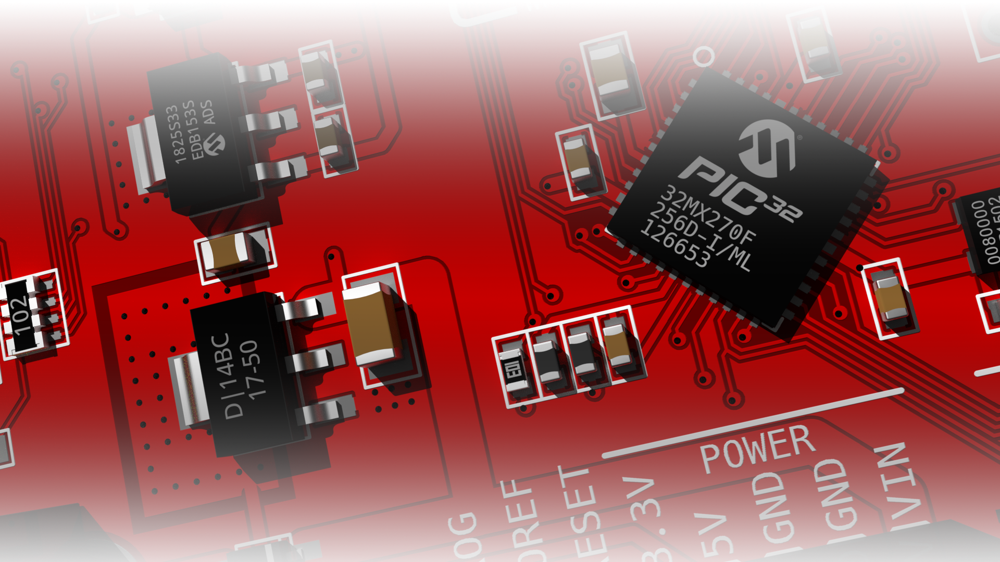

 

PCB-Blender

Blender addon for visualization of printed circuit board (PCB) projects created in Gerber (RS-274X) and Excellon format.
Developed as part of my Master Thesis ([PL](https://github.com/adammak23/PCB-Blender/blob/master/xelatex-mgr-master/magisterka.pdf), ENG (to be added))

Links to .blend model packages:
- [KiCad](https://drive.google.com/file/d/13XPhmWK7C0UOgMiue4U_l_PDTFWbCmsc/view?usp=sharing)
- [gEDA](https://drive.google.com/file/d/1f8NjVyEgBYInyVxm_Tka4bmXz_6UZx5u/view?usp=sharing)
- [Eagle](https://drive.google.com/file/d/1A_rOZ67kWDz7st1iD3GfgFiSNWOtfTx2/view?usp=sharing)

All packages stored on [My Google Drive Folder](https://drive.google.com/drive/folders/1vVREEy2yFZxJN8ogHBjQFaNlgMFhQrmn?usp=sharing)

Full credit:
- Models taken from:
	- [KiCad - sources3d](https://github.com/kicad/packages3d-source) (.wrl)
	- [majenkotech - PCB-Blend](https://github.com/majenkotech/PCB-Blend) (.blend)
	- [hyOzd - pcb2blender](https://bitbucket.org/hyOzd/pcb2blender/src/master/) (.blend)

Potential additional functionalities that can be included in the project to improve the user experience and increase the program's capabilities:

For .wrl importer
- Decrease filezise by instanced mesh (a lot of models have multiple repeating elements), potential solutions (in regards to model 3D database creation):
	- a lot of manual work;
	- super smart importer that recognizes similarities;
	- array modifier (e.g. PinSocket 1x1 multiplied to create all other same-type sockets)

For PCB-Blender
- Rendering any number of layers (the ability to select any number of files and the order in which they are rendered)
- Append more regular expressions (detecting and correctly classifying more extensions and file names)
- Define other palettes and color schemes for PCB images renders
- Support for other project file formats (the pcb-tools module announces in its description that they planned support for IPC-2581, ODB ++ and other ([source](https://pcb-tools.readthedocs.io/en))

