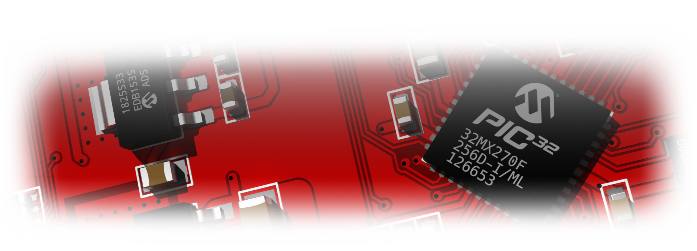

 

PCB-Blender
Blender addon for visualization of printed circuit board (PCB) projects created in gEDA PCB, KiCad...
TODO:
- FreeCAD support
- Decrease filezise by instanced mesh (a lot of models have multiple repeating elements), potential solutions:
	- a lot of manual work;
	- super smart importer that recognizes similarities;
	- array modifier (e.g. PinSocket 1x1 multiplied to create all other same-type sockets)
